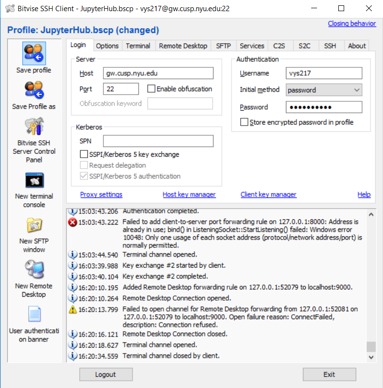
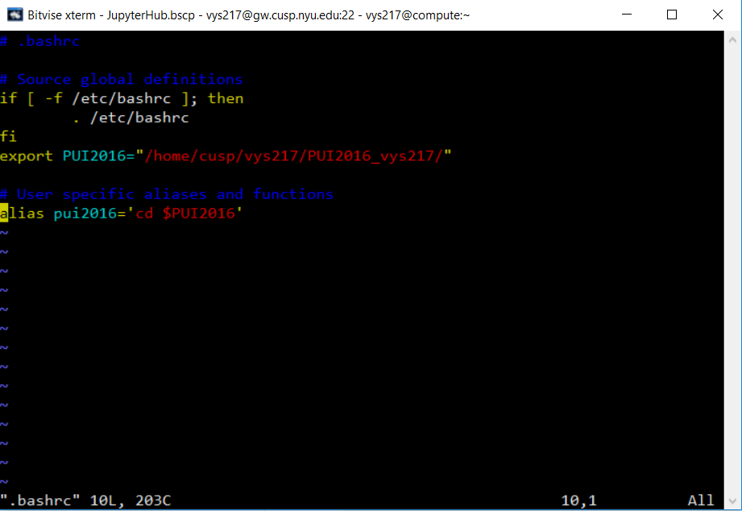

# PUI2016

## 1. Setting the Enviornment

Step 1 - From windows PC connected to the Data Facility using my netid, password and host as "gw.cusp.nyu.edu"

Step 2 - Opened a new terminal console from the options available in the left side of Bitvise SSH client

Step 3 - Connect to 'compute' using command "ssh -X -A compute"

Step 4 - Created the "PUI2016_vys217" directory, inside the directory changed the .bashrc file to add the enviroment variable and the alias as below

The export statement assings the given path to the variable 'PUI2016' and alias assigns the given command to the variable 'pui2016'. The export and alias statement are written in .bashrc file so that they are preserved for every terminal which we use.

When the alias 'pui2016' is called in the terminal, it executes the command 'cd(change directory) /home/cusp/vys217/PUI2016_vys217/(enviroment variable PUI2016)

Step 5 - Set Up the GitHub repository for 'PUI2016_vys217', set up the remote git repository 'PUI2016_vys217' in 'compute'. 

Step 6 - Add another directory 'HW1_vys217', inside it create the README.md file, add the screenshot images.

Step 7 - Create the link between Github repo 'PUI2016_vys217' and remote repo then add, commit and push our changes. 
